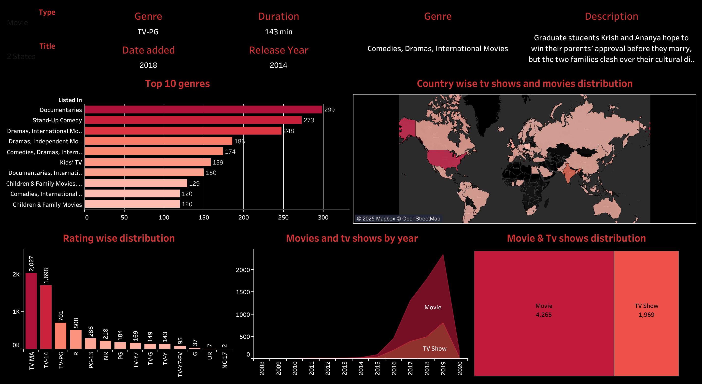

# Netflix Analysis Dashboard 🎬📊

This project analyzes Netflix's dataset of 6,000+ titles using Python for EDA and Power BI for dashboard visualization.

## 📁 Dataset
- Source: [Netflix Titles CSV](https://www.kaggle.com/datasets/shivamb/netflix-shows)
- File: `netflix_titles.csv`

## 🛠 Tools Used
- Python (Pandas, Matplotlib, Seaborn)
- Power BI
- Jupyter Notebook

## 📊 Dashboard Features
- Top 10 genres frequency
- Country-wise title distribution
- Ratings breakdown
- Content release trend by year

## 📸 Screenshots

## 🔗 How to Use
- Run `netflix_analysis.ipynb` for Python EDA
- Open `.pbix` file in Power BI to explore the dashboard

## 📌 Author
Akshat More – [LinkedIn](https://linkedin.com/in/akshatmore) | [GitHub](https://github.com/AkshatMore15)
